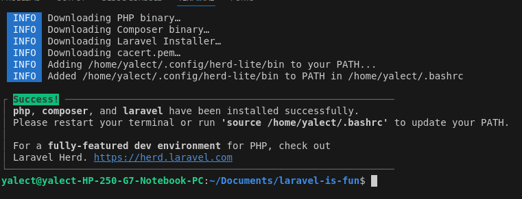

# laravel-is-fun
learning laravel

- [laravel official documentation](https://laravel.com/docs/11.x)
- [routing](https://laravel.com/docs/11.x/routing)
- [sanctum for authentication](https://laravel.com/docs/11.x/sanctum)
- [eloquent ORM](https://laravel.com/docs/11.x/eloquent)

## Install laravel

For linux OS __I'm using ubuntu 24.04 LTS__ run the command below, for other OS check the [documentation](https://laravel.com/docs/11.x)

``` /bin/bash -c "$(curl -fsSL https://php.new/install/linux/8.4)" ```

